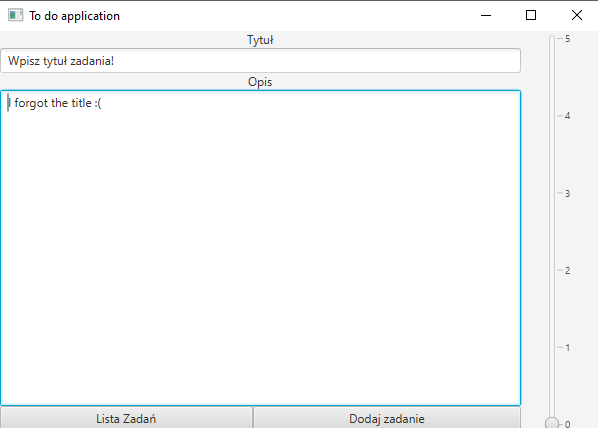
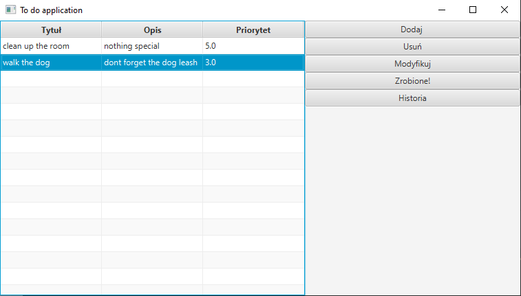
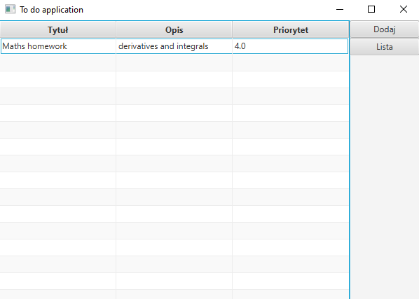

# List ToDoApplication
Window ToDo application made using JavaFX and Spring Data (with MySQL)


## Table of contents
* [General info](#general-info)
* [Screenshots](#screenshots)
* [Technologies](#technologies)
* [Setup](#setup)

## General info
This project is window ToDo application made in JavaFX. Each adding task has title, description and priority (0-5). 
It has 3 separate windows connects each other. Besides it is connected with MySQL by Spring Data. User can add tasks, 
remove and mark if it's done. Quests are sorted by priority on ready list. Done tasks are on another list. 
User can modify task at any moment clicking modify button.
	
## Screenshots




## Technologies
Project is created with:
* Spring Boot
* Spring Data
* MySQL
* JavaFX
* Maven
	
## Setup
To run this project, download it and create file in "resource" directory called "application.properties".
In this file set connection properties with your database, for example:

```
 spring.datasource.url=jdbc:mysql://localhost:3306/
 spring.datasource.username=admin
 spring.datasource.password=admin
 spring.jpa.hibernate.ddl-auto=create 
 spring.jpa.show-sql=true

```
